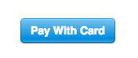

# ReactJS Stripe Checkout Component (Prodio)

Stripe's Checkout makes it almost too easy to take people's money.
This should make it even easier if you're building a react
application.

### Installation

Get started by installing with npm

    npm install stripe-react-sdk-prodio --save


### Requirements

`token` and `stripeKey` are the only *required* props,
everything else is optional as per the stripe docs. See [Checkout
Docs](https://stripe.com/docs/checkout#integration-custom). All props
go through simple validation and are passed to stripe checkout, they're
also documented in `StripeCheckout.js`.

```jsx
import React from 'react'
import StripeCheckout from 'stripe-react-sdk-prodio';

export default class PaymentClass extends React.Component {

  constructor(props) {
      super(props);
      this.state = {
        totalAmountToPay : 89,
        userEmail:"shashikant@prodio.in"
      }
  }

  onToken = (token) => {
    let sampleMetaData = {
      "totalAmountToPay": this.state.totalAmountToPay,            //mandatory
      "userEmail": this.state.userEmail,                              //mandatory
      "title": "Payment for services",                 //madatory - payment reference title
      "payerId":"",                                    //madatory - from prodio payment module
      "merchantId":"",                                 //madatory - from prodio payment module
      "webhookUrl":"",      //optional - if you want to receive complete metaData in your apis
      "businessName":"",                                //You can add any key value pairs
      "customKey":"customValue"
    }
    let sendData = {
      "metaData": sampleMetaData,
      "token": token
    }

    ## NOTE : If you using API_GATEWAY - then create api gateway end point and point it to the below api url.
    //To get this URL working you need to run "Prodio-payment-services" on the server
    //{{hostname}} is server domain or IP.

    axios.post(`http://{{hostname}}:3010/api/StripeConnector/verifyStripeToken`, sendData).then(result => {
        result.json().then(data => {
          alert(`Payment completed successfully`);
        });
      }).catch(error => {
        alert('Error while processing payment : '+JSON.stringify(error))
      });

  }

  // ...

  render() {
    return (
      // ...
      <StripeCheckout
        token={this.onToken}
        stripeKey="{publish_key_from_stripe}"
        amount={ (this.state.totalAmountToPay) * 100 } // cents
        currency="USD"
        email={(this.state.userEmail)}
        name="Payment Form"
        label="Pay" // text inside the Stripe button
        containerStyle={{height:100,width:200,background:"#fff"}}
        buttonStyle={{height:100,width:200,background:"#dddd"}}
      />
    )
  }
}
```

This will give you a default *Stripe-style* button which looks like this:



### Send all the props!

```jsx
<StripeCheckout
  name="Payment Transaction" // the pop-in header title
  description="Here you can write the description" // the pop-in header subtitle
  image="{REMOTE_URL_FOR_THE_IMAGE}" // the pop-in header image (default none)
  label="Let's Pay" // text inside the Stripe button
  panelLabel="Give Money" // prepended to the amount in the bottom pay button
  amount={1000000} // cents
  containerStyle={{}} //container style
  buttonStyle={{}} //payment button style object
  currency="USD"
  stripeKey="..."
  locale="en"
  email=""
  // Note: Enabling either address option will give the user the ability to
  // fill out both. Addresses are sent as a second parameter in the token callback.
  shippingAddress
  billingAddress={false}
  // Note: enabling both zipCode checks and billing or shipping address will
  // cause zipCheck to be pulled from billing address (set to shipping if none provided).
  zipCode={false}
  allowRememberMe // "Remember Me" option (default true)
  token={this.onToken} // submit callback
  opened={this.onOpened} // called when the checkout popin is opened (no IE6/7)
  closed={this.onClosed} // called when the checkout popin is closed (no IE6/7)
  >
  <button className="btn btn-primary">
    Use your own child component, which gets wrapped in whatever
    component you pass into as "ComponentClass" (defaults to span)
  </button>
</StripeCheckout>
```
